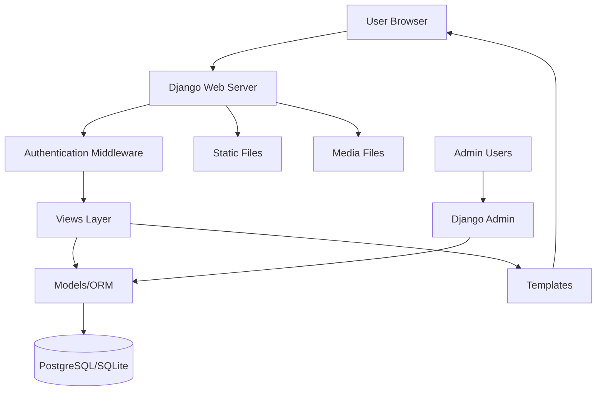
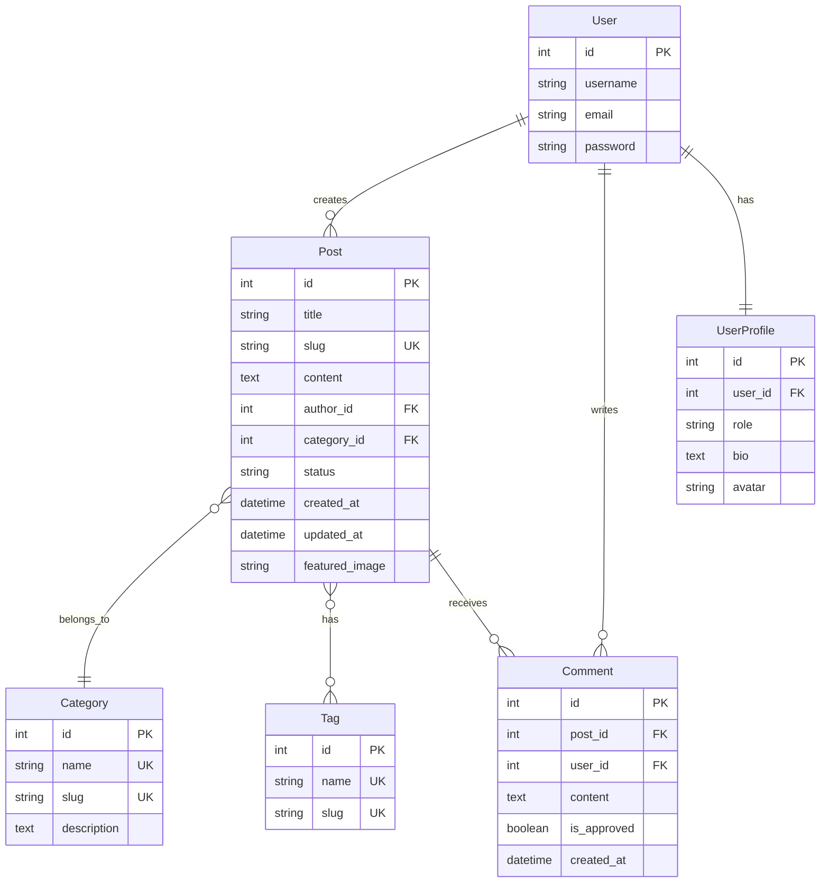

# Design Document

## Overview

The Django Blog Platform is a full-featured web application built using Django 4.x that provides a complete blogging solution with user management, content creation, and community interaction features. The system follows Django's MVT (Model-View-Template) architecture and leverages Django's built-in authentication, admin interface, and ORM capabilities.

The platform is organized into two main Django apps:
- **blog**: Handles posts, categories, tags, and comments
- **accounts**: Manages user authentication and role-based permissions

## Architecture

### High-Level Architecture



### Application Structure

```
advanced_blog/
├── advanced_blog/          # Project configuration
│   ├── settings.py
│   ├── urls.py
│   ├── wsgi.py
│   └── asgi.py
├── blog/                   # Blog app
│   ├── models.py          # Post, Category, Tag, Comment
│   ├── views.py           # Post views, search, filtering
│   ├── forms.py           # Post and comment forms
│   ├── urls.py
│   ├── admin.py           # Custom admin configuration
│   ├── signals.py         # Post publication signals
│   └── templates/blog/
├── accounts/              # User management app
│   ├── models.py         # User profile extensions
│   ├── views.py          # Auth views, dashboard
│   ├── forms.py          # Registration, login forms
│   ├── urls.py
│   └── templates/accounts/
├── static/               # CSS, JS, images
├── media/                # User-uploaded content
└── templates/            # Base templates
```

### Technology Stack

- **Framework**: Django 4.x
- **Database**: PostgreSQL (production) / SQLite (development)
- **Frontend**: Bootstrap 5 or Tailwind CSS
- **Rich Text**: Django CKEditor or TinyMCE
- **Image Processing**: Pillow
- **Deployment**: Heroku or PythonAnywhere

## Components and Interfaces

### Models

#### User Model Extension

Django's built-in User model will be extended with a custom profile:

```python
# accounts/models.py
class UserProfile(models.Model):
    ROLE_CHOICES = [
        ('admin', 'Admin'),
        ('author', 'Author'),
        ('reader', 'Reader'),
    ]
    user = models.OneToOneField(User, on_delete=models.CASCADE)
    role = models.CharField(max_length=10, choices=ROLE_CHOICES, default='reader')
    bio = models.TextField(blank=True)
    avatar = models.ImageField(upload_to='avatars/', blank=True, null=True)
```

#### Blog Models

**Category Model**:
```python
class Category(models.Model):
    name = models.CharField(max_length=100, unique=True)
    slug = models.SlugField(max_length=100, unique=True)
    description = models.TextField(blank=True)
    created_at = models.DateTimeField(auto_now_add=True)
    
    def __str__(self):
        return self.name
```

**Tag Model**:
```python
class Tag(models.Model):
    name = models.CharField(max_length=50, unique=True)
    slug = models.SlugField(max_length=50, unique=True)
    created_at = models.DateTimeField(auto_now_add=True)
    
    def __str__(self):
        return self.name
```

**Post Model**:
```python
class Post(models.Model):
    STATUS_CHOICES = [
        ('draft', 'Draft'),
        ('published', 'Published'),
    ]
    
    title = models.CharField(max_length=200)
    slug = models.SlugField(max_length=200, unique=True)
    content = models.TextField()  # Will use RichTextField with CKEditor
    author = models.ForeignKey(User, on_delete=models.CASCADE, related_name='posts')
    category = models.ForeignKey(Category, on_delete=models.SET_NULL, null=True, related_name='posts')
    tags = models.ManyToManyField(Tag, related_name='posts', blank=True)
    status = models.CharField(max_length=10, choices=STATUS_CHOICES, default='draft')
    featured_image = models.ImageField(upload_to='posts/', blank=True, null=True)
    created_at = models.DateTimeField(auto_now_add=True)
    updated_at = models.DateTimeField(auto_now=True)
    
    class Meta:
        ordering = ['-created_at']
    
    def __str__(self):
        return self.title
```

**Comment Model**:
```python
class Comment(models.Model):
    post = models.ForeignKey(Post, on_delete=models.CASCADE, related_name='comments')
    user = models.ForeignKey(User, on_delete=models.CASCADE)
    content = models.TextField()
    is_approved = models.BooleanField(default=True)
    created_at = models.DateTimeField(auto_now_add=True)
    
    class Meta:
        ordering = ['created_at']
    
    def __str__(self):
        return f'Comment by {self.user.username} on {self.post.title}'
```

### Views Architecture

#### Class-Based Views (CBVs)

The application will primarily use Django's generic class-based views for consistency and code reuse:

- **ListView**: For post lists, category/tag filtered views
- **DetailView**: For individual post display
- **CreateView**: For post and comment creation
- **UpdateView**: For post editing
- **DeleteView**: For post deletion
- **FormView**: For search functionality

#### View Mixins

Custom mixins will enforce permissions:

```python
class AuthorRequiredMixin:
    """Ensures user is author of the post or admin"""
    
class RoleRequiredMixin:
    """Checks if user has required role"""
```

#### Key Views

1. **PostListView**: Displays paginated published posts
2. **PostDetailView**: Shows post with comments
3. **PostCreateView**: Form for creating new posts (authors only)
4. **PostUpdateView**: Edit existing posts (author/admin only)
5. **PostDeleteView**: Delete posts (author/admin only)
6. **CategoryPostListView**: Filtered posts by category
7. **TagPostListView**: Filtered posts by tag
8. **SearchView**: Search results with highlighting
9. **AuthorDashboardView**: Author's post management interface
10. **CommentCreateView**: Add comments to posts

### Forms

#### Post Form
```python
class PostForm(forms.ModelForm):
    class Meta:
        model = Post
        fields = ['title', 'content', 'category', 'tags', 'status', 'featured_image']
        widgets = {
            'content': CKEditorWidget(),
        }
    
    def save(self, commit=True):
        # Auto-generate slug from title
        pass
```

#### Comment Form
```python
class CommentForm(forms.ModelForm):
    class Meta:
        model = Comment
        fields = ['content']
```

#### User Registration Form
```python
class UserRegistrationForm(UserCreationForm):
    email = forms.EmailField(required=True)
    
    class Meta:
        model = User
        fields = ['username', 'email', 'password1', 'password2']
```

### URL Structure

```
/                           # Home page (post list)
/post/<slug>/               # Post detail
/post/create/               # Create new post
/post/<slug>/edit/          # Edit post
/post/<slug>/delete/        # Delete post
/category/<slug>/           # Category filtered posts
/tag/<slug>/                # Tag filtered posts
/search/                    # Search results
/accounts/register/         # User registration
/accounts/login/            # User login
/accounts/logout/           # User logout
/accounts/dashboard/        # Author dashboard
/admin/                     # Django admin panel
```

## Data Models

### Entity Relationship Diagram



### Database Indexes

For optimal query performance:
- Post: Index on `slug`, `status`, `created_at`, `author_id`, `category_id`
- Category: Index on `slug`
- Tag: Index on `slug`
- Comment: Index on `post_id`, `created_at`

## Error Handling

### Permission Errors

- **403 Forbidden**: Custom template when users attempt unauthorized actions
- Redirect to login page for unauthenticated users attempting protected actions
- Display user-friendly error messages for permission violations

### Form Validation Errors

- Display inline validation errors on forms
- Highlight invalid fields with Bootstrap error styling
- Provide clear error messages for:
  - Duplicate slugs
  - Invalid image formats
  - Required field violations
  - Password strength requirements

### 404 Errors

- Custom 404 template for non-existent posts, categories, or tags
- Suggest similar content or return to home page

### Server Errors (500)

- Custom 500 error template
- Log errors to file for debugging
- Display generic error message to users without exposing system details

## Testing Strategy

### Unit Tests

Test individual components in isolation:

1. **Model Tests**:
   - Slug generation and uniqueness
   - Model relationships (ForeignKey, ManyToMany)
   - Default values and choices
   - String representations

2. **Form Tests**:
   - Valid and invalid input handling
   - Custom validation logic
   - Widget rendering

3. **View Tests**:
   - Permission checks
   - Context data
   - Template rendering
   - Redirects after actions

### Integration Tests

Test component interactions:

1. **Authentication Flow**:
   - Registration → Login → Access protected pages
   - Role-based access control

2. **Post Workflow**:
   - Create draft → Edit → Publish → View
   - Comment creation and display

3. **Search and Filter**:
   - Search query processing
   - Category/tag filtering
   - Pagination across filtered results

### Functional Tests

Test user workflows with Selenium or Django's test client:

1. Complete post creation and publication flow
2. User registration and login flow
3. Comment submission and moderation
4. Search and navigation

### Test Coverage Goals

- Minimum 80% code coverage
- 100% coverage for critical paths (authentication, permissions, post creation)
- Focus on business logic over boilerplate code

### Testing Tools

- Django's built-in TestCase and Client
- Factory Boy for test data generation
- Coverage.py for coverage reporting
- pytest-django (optional alternative to unittest)

## Security Considerations

### Authentication & Authorization

- Use Django's built-in authentication system
- Implement CSRF protection on all forms
- Enforce role-based permissions with mixins and decorators
- Use `@login_required` decorator for protected views

### Input Validation

- Sanitize user input to prevent XSS attacks
- Validate file uploads (type, size)
- Use Django's ORM to prevent SQL injection
- Implement rate limiting on forms (optional)

### Password Security

- Use Django's password hashing (PBKDF2 by default)
- Enforce password strength requirements
- Implement password reset functionality

### Media File Security

- Validate uploaded file types and sizes
- Store media files outside web root
- Use unique filenames to prevent overwrites
- Consider virus scanning for production (optional)

## Performance Optimization

### Database Optimization

- Use `select_related()` for ForeignKey relationships
- Use `prefetch_related()` for ManyToMany relationships
- Implement database indexes on frequently queried fields
- Use `only()` and `defer()` to limit field selection when appropriate

### Caching Strategy

- Cache post list views (5-10 minutes)
- Cache category and tag lists
- Use Django's cache framework with Redis or Memcached
- Implement template fragment caching for expensive operations

### Query Optimization

Example optimized query for post list:
```python
Post.objects.filter(status='published')\
    .select_related('author', 'category')\
    .prefetch_related('tags')\
    .order_by('-created_at')
```

### Static File Handling

- Use Django's `collectstatic` for production
- Implement CDN for static assets (optional)
- Enable GZIP compression
- Use WhiteNoise for serving static files on Heroku

## Deployment Architecture

### Development Environment

- SQLite database
- Django development server
- Debug mode enabled
- Local media file storage

### Production Environment (Heroku/PythonAnywhere)

- PostgreSQL database
- Gunicorn WSGI server
- Debug mode disabled
- AWS S3 or similar for media storage (optional)
- Environment variables for sensitive settings
- HTTPS enforcement
- Static file serving via WhiteNoise or CDN

### Environment Configuration

Use environment variables for:
- `SECRET_KEY`
- `DEBUG`
- `DATABASE_URL`
- `ALLOWED_HOSTS`
- `AWS_ACCESS_KEY_ID` (if using S3)
- `EMAIL_HOST_PASSWORD` (for notifications)

### Deployment Checklist

1. Set `DEBUG = False`
2. Configure `ALLOWED_HOSTS`
3. Set up PostgreSQL database
4. Configure static file serving
5. Set up media file storage
6. Run migrations
7. Create superuser
8. Collect static files
9. Configure environment variables
10. Test all functionality in production

## Admin Panel Customization

### Post Admin

```python
@admin.register(Post)
class PostAdmin(admin.ModelAdmin):
    list_display = ['title', 'author', 'category', 'status', 'created_at']
    list_filter = ['status', 'category', 'created_at']
    search_fields = ['title', 'content']
    prepopulated_fields = {'slug': ('title',)}
    raw_id_fields = ['author']
    date_hierarchy = 'created_at'
    ordering = ['-created_at']
    actions = ['make_published', 'make_draft']
```

### Comment Admin

```python
@admin.register(Comment)
class CommentAdmin(admin.ModelAdmin):
    list_display = ['user', 'post', 'created_at', 'is_approved']
    list_filter = ['is_approved', 'created_at']
    search_fields = ['content', 'user__username']
    actions = ['approve_comments', 'disapprove_comments']
```

### Category and Tag Admin

Simple admin registration with slug prepopulation:
```python
@admin.register(Category)
class CategoryAdmin(admin.ModelAdmin):
    prepopulated_fields = {'slug': ('name',)}

@admin.register(Tag)
class TagAdmin(admin.ModelAdmin):
    prepopulated_fields = {'slug': ('name',)}
```


## Signal Implementation

### Post Publication Signal

```python
# blog/signals.py
from django.db.models.signals import post_save
from django.dispatch import receiver
from .models import Post
import logging

logger = logging.getLogger(__name__)

@receiver(post_save, sender=Post)
def post_published_handler(sender, instance, created, **kwargs):
    """
    Signal handler triggered when a post is published.
    Logs the publication and can be extended for notifications.
    """
    if not created and instance.status == 'published':
        logger.info(f'Post published: {instance.title} by {instance.author.username}')
        # Future: Send email notifications, update RSS feed, etc.
```

### Signal Registration

Signals will be registered in the app's `apps.py`:
```python
# blog/apps.py
from django.apps import AppConfig

class BlogConfig(AppConfig):
    default_auto_field = 'django.db.models.BigAutoField'
    name = 'blog'
    
    def ready(self):
        import blog.signals
```

## Middleware (Optional)

### User Activity Tracking Middleware

```python
# accounts/middleware.py
import logging

logger = logging.getLogger(__name__)

class UserActivityMiddleware:
    def __init__(self, get_response):
        self.get_response = get_response
    
    def __call__(self, request):
        if request.user.is_authenticated:
            logger.info(f'User {request.user.username} accessed {request.path}')
        
        response = self.get_response(request)
        return response
```

## Template Structure

### Base Template

```html
<!-- templates/base.html -->
<!DOCTYPE html>
<html lang="en">
<head>
    <meta charset="UTF-8">
    <meta name="viewport" content="width=device-width, initial-scale=1.0">
    <title>Django Blog</title>
    <link href="https://cdn.jsdelivr.net/npm/bootstrap@5.3.0/dist/css/bootstrap.min.css" rel="stylesheet">
    
</head>
<body>
    
    
    <main class="container my-4">
        
            
                <div class="alert alert-{{ message.tags }}">{{ message }}</div>
            
        
        
        
    </main>
    
    
    
    <script src="https://cdn.jsdelivr.net/npm/bootstrap@5.3.0/dist/js/bootstrap.bundle.min.js"></script>
    
</body>
</html>
```

### Key Template Pages

1. **Home Page** (`blog/post_list.html`): Paginated post list with excerpts
2. **Post Detail** (`blog/post_detail.html`): Full post with comments
3. **Post Form** (`blog/post_form.html`): Create/edit post form
4. **Category/Tag List** (`blog/category_posts.html`, `blog/tag_posts.html`): Filtered posts
5. **Search Results** (`blog/search_results.html`): Search results with highlighting
6. **Dashboard** (`accounts/dashboard.html`): Author's post management
7. **Login/Register** (`accounts/login.html`, `accounts/register.html`): Authentication forms

## Third-Party Packages

### Required Packages

```
Django==4.2.7
Pillow==10.1.0
django-ckeditor==6.7.0
psycopg2-binary==2.9.9  # For PostgreSQL
gunicorn==21.2.0  # For production
whitenoise==6.6.0  # For static files
python-decouple==3.8  # For environment variables
```

### Optional Packages

```
django-debug-toolbar==4.2.0  # Development debugging
django-extensions==3.2.3  # Useful management commands
factory-boy==3.3.0  # Test data generation
coverage==7.3.2  # Test coverage
```

## Configuration Management

### Settings Structure

Split settings into multiple files:

```
advanced_blog/settings/
├── __init__.py
├── base.py      # Common settings
├── development.py  # Dev-specific settings
└── production.py   # Production settings
```

### Key Settings

**base.py**:
- Installed apps
- Middleware
- Template configuration
- Static/media file paths
- Authentication backends

**development.py**:
- DEBUG = True
- SQLite database
- Email backend (console)

**production.py**:
- DEBUG = False
- PostgreSQL database
- Email backend (SMTP)
- Security settings (SECURE_SSL_REDIRECT, etc.)

## Documentation Requirements

### README.md

Should include:
1. Project overview and features
2. Technology stack
3. Installation instructions
4. Environment setup
5. Running the development server
6. Running tests
7. Deployment instructions
8. Screenshots of key pages
9. Database schema diagram
10. Contributing guidelines (if open source)

### Code Documentation

- Docstrings for all models, views, and complex functions
- Inline comments for non-obvious logic
- Type hints where appropriate (Python 3.10+)

## Future Enhancements

Potential features for future iterations:

1. **Social Features**:
   - Like/favorite posts
   - Follow authors
   - Share to social media

2. **Advanced Content**:
   - Post series/collections
   - Featured posts
   - Related posts suggestions

3. **Analytics**:
   - View count tracking
   - Popular posts widget
   - Author statistics

4. **API**:
   - REST API with Django REST Framework
   - Mobile app support

5. **Performance**:
   - Full-text search with Elasticsearch
   - Redis caching layer
   - CDN integration

6. **Moderation**:
   - Comment approval workflow
   - Spam detection
   - Content reporting

This design provides a solid foundation for building a production-ready Django blog platform that meets all specified requirements while remaining maintainable and scalable.
